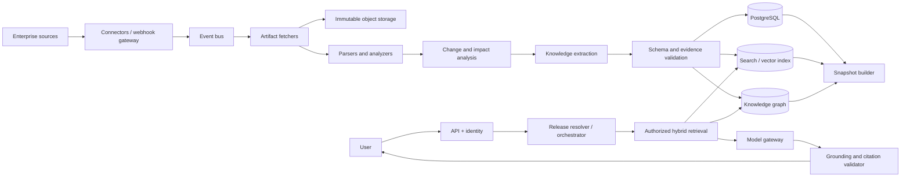

# Architecture

## Design principles

1. Release scope is a security and correctness boundary.
2. Raw source revisions are preserved before transformation.
3. Derived knowledge is reproducible and fully versioned.
4. Online serving and offline construction scale independently.
5. Deterministic checks surround probabilistic extraction and generation.
6. The system fails closed on authorization, snapshot integrity, and evidence validation.

## Logical architecture

## Knowledge construction plane

| Component | Responsibility |
| --- | --- |
| Connector manager | Configuration, credentials, scope, schedules, and health. |
| Webhook gateway | Signature verification, normalization, deduplication, and event persistence. |
| Event bus | Durable routing, retry, replay, and back-pressure. |
| Artifact fetcher | Fetch immutable source revisions and ACL metadata. |
| Object store | Preserve raw and normalized artifacts using content-addressed keys. |
| Parser/analyzer | Create structural representations using AST/schema/document parsers. |
| Change detector | Compare versions and identify changed semantic units. |
| Impact analyzer | Traverse dependencies to calculate regeneration scope. |
| Extraction service | Produce typed entities, relationships, assertions, and change events. |
| Entity resolver | Connect extracted records to canonical product entities. |
| Index/graph writers | Publish versioned chunks and temporal relationships. |
| Snapshot builder | Assemble, validate, sign, and atomically publish a release view. |

## Knowledge consumption plane

| Component | Responsibility |
| --- | --- |
| Web/API gateway | Authentication, request validation, rate limits, and streaming. |
| Conversation service | Release-pinned state and user-visible history. |
| Release resolver | Resolve requested or approved-default release to snapshot ID. |
| Query planner | Classify intent and choose search, graph, comparison, or traceability workflow. |
| Authorization filter | Apply tenant/product/release/ACL scope before retrieval. |
| Hybrid retriever | Run lexical, vector, graph, and metadata retrieval in parallel. |
| Reranker/context builder | Rank, deduplicate, compress, and package evidence. |
| Model gateway | Provider routing, schema enforcement, retries, cost, and policy. |
| Validator | Verify release match, authorization, claim support, and citations. |

## Controlled agent workflow

Agents are bounded workflow roles, not unrestricted autonomous actors:

1. Supervisor selects an approved workflow and maintains state.
2. Release resolver binds product, release, tenant, and snapshot.
3. Retrieval agent requests authorized evidence.
4. Graph agent resolves dependency or lineage paths when needed.
5. Comparison agent creates a structured two-release diff.
6. Validation agent checks claims and citations.
7. Response agent renders the final answer without adding unsupported facts.

Every tool call has a typed schema, timeout, retry policy, least-privilege permission, and audit record. Retrieved content cannot issue tool instructions.

## Storage choices

| Store | Data |
| --- | --- |
| Object storage | Immutable raw/normalized artifact versions and manifests. |
| PostgreSQL | Tenants, products, releases, connectors, jobs, ACLs, audit, and feedback. |
| Search/vector engine | Release-scoped chunks, keywords, embeddings, filters, and citations. |
| Knowledge graph | Canonical entities, versions, lineage, dependencies, and impacts. |
| Redis | Short-lived cache, rate limits, and ephemeral workflow state only. |
| Analytics store | Aggregated usage, evaluation, cost, and operational reporting. |

For an MVP, PostgreSQL plus pgvector can combine metadata and vector search; a dedicated search engine and graph database are introduced when retrieval scale or traversal complexity justifies them.

## Key decisions and trade-offs

- **Immutable snapshots over live-only indexes:** higher storage cost, but reproducible answers and audits.
- **Structural chunks over fixed windows:** more parsing work, but better citations and code understanding.
- **Graph plus RAG:** more operational complexity, but explicit lineage and multi-hop impact analysis.
- **Snapshot aliases/segments over full index copies:** reduces duplication while maintaining immutability.
- **Model gateway over direct provider calls:** adds a hop, but centralizes policy, routing, and cost.

Record material changes using [the ADR template](adr-template.md).

